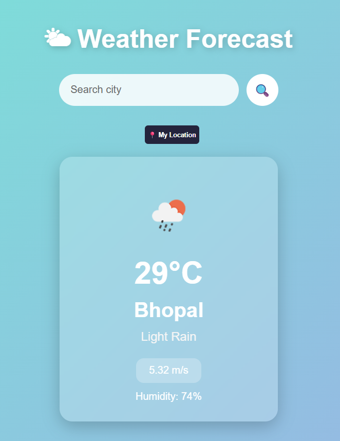

# 🌤 Weather App

A responsive Weather App built with HTML, CSS, and JavaScript that integrates the OpenWeather API to display real-time weather information.

## ✨ Features

- 🔍 Search weather by city name
- 📍 Get weather using current location
- 🌡 Display temperature
- 💧 Show humidity
- 🌬 Show wind speed
- 🌤 Weather icons
- ⌨ Search using the Enter key
- ⏳ Loading indicator
- ❌ Error handling for invalid cities and network issues
- 📱 Responsive design

## 🛠 Technologies Used

- HTML5
- CSS3
- JavaScript (ES6)
- OpenWeather API
- Geolocation API

## 🚀 How to Run

1. Clone the repository.
2. Open `index.html` in your browser.
3. Enter a city name or use the location button.

## 📸 Screenshot

## 🚀 Live Demo

🌐 https://krish-code91.github.io/Weather-App/

## 👨‍💻 Author

Krish Jain
